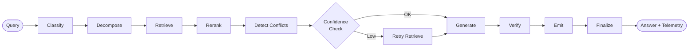

<div align="center">

# Agentic RAG Legal Challenge 2026

**Evidence-first legal question answering over DIFC regulations, case law, and contracts.**

Built for the [Agentic RAG Legal Challenge](https://machinescansee.com) at Dubai AI Week & Machines Can See 2026.

[](https://python.org)
[](https://fastapi.tiangolo.com)
[](https://langchain-ai.github.io/langgraph/)
[](https://qdrant.tech)

</div>

---

## Project Status

Raw evaluation JSON artifacts are kept out of the public repository.

The project is maintained against a verified **local Docker** workflow, with public-trial evaluation used as an engineering checkpoint rather than bundled as raw repo artifacts.

Current focus:

- faithful page-level provenance tied to the final emitted answer
- stable multi-entity free-text generation without unsupported carry-over
- low-latency local serving with full telemetry and auditability
- private-set robustness beyond public-trial overfitting

---

## Architecture

Every query flows through a staged LangGraph pipeline with conditional retry on low-confidence retrieval:



Key design choices:

- Hybrid retrieval: dense embeddings + BM25 sparse search fused via Reciprocal Rank Fusion
- Legal-domain embeddings: Kanon 2 Embedder for DIFC-heavy terminology and statute references
- Reranking: Zerank 2 with Cohere Rerank fallback
- Model routing: `gpt-4.1-mini` for strict answer types, `gpt-4.1` for complex free-text reasoning
- Faithfulness guardrails: premise guard, conflict detection, citation verification, and final post-processing bound to `answer_final`
- Telemetry bound to the final answer: `used_page_ids`, `cited_page_ids`, per-stage timings, and model metadata in every response

The system was developed with support from [SDDRush](https://github.com/chernistry/SDDRush), a lightweight toolkit I built for research, best-practice capture, and implementation tickets.

---

## License

This repository is source-available under the PolyForm Noncommercial License 1.0.0.

Commercial use requires a separate written license from Alex Chernysh.
See [COMMERCIAL-LICENSING.md](COMMERCIAL-LICENSING.md) for contact details.

---

## Quick Start

```bash
# 1. Start the local stack (API + local Qdrant)
docker compose up --build -d

# 2. Ingest the DIFC corpus
docker compose --profile tools run --rm ingest

# 3. Run the local eval harness with judge inside Docker
docker compose --profile tools run --rm eval \
  python -m rag_challenge.eval.harness \
  --golden dataset/public_dataset.json \
  --endpoint http://api:8000/query \
  --concurrency 4 \
  --emit-cases \
  --judge \
  --judge-scope free_text \
  --judge-docs-dir dataset/dataset_documents \
  --judge-out data/judge_local.jsonl \
  --out data/eval_local.json

# 4. Ask a question
curl -X POST http://localhost:8000/query \
  -H "Content-Type: application/json" \
  -d '{"question": "Which laws are administered by the Registrar?"}'
```

The default `docker compose` setup brings up:

- `qdrant` locally, with health checks
- `api` with warmup enabled by default
- `ingest` and `eval` as tool-profile services inside the same Docker network

No extra `QDRANT_URL` juggling is required for the default local workflow.

## Platform Submission

The repository now has a separate **platform-native** submission path for warm-up/final runs.
It is intentionally separate from the local eval harness and keeps each phase in its own corpus/index.

Recommended flow:

```bash
# 1. Start local infrastructure
docker compose up --build -d qdrant

# 2. Preflight only: build and audit the curated code archive
docker compose --profile tools run --rm eval \
  python -m rag_challenge.submission.platform --archive-only

# 3. Build a warm-up submission package without uploading
docker compose --profile tools run --rm eval \
  python -m rag_challenge.submission.platform

# 4. Inspect the generated artifacts
#   - platform_runs/<phase>/submission.json
#   - platform_runs/<phase>/preflight_summary.json
#   - platform_runs/<phase>/code_archive.zip
#   - platform_runs/<phase>/code_archive_audit.json

# 5. Submit the exact inspected artifact and poll status
docker compose --profile tools run --rm eval \
  python -m rag_challenge.submission.platform \
    --submit-existing \
    --submission-path platform_runs/warmup/submission.json \
    --code-archive-path platform_runs/warmup/code_archive.zip \
    --poll
```

What this flow does:

- downloads phase-specific `documents` from the platform API
- stores them under `platform_runs/<phase>/`
- ingests them into a phase-specific Qdrant collection
- only then downloads phase-specific `questions`
- runs the same RAG pipeline directly against those questions
- emits a platform-shaped `submission.json`
- emits a local `preflight_summary.json` for first-run triage
- builds a curated `code_archive.zip` from an allowlist
- audits the archive for forbidden paths, secrets, and size before upload

Important:

- `EVAL_API_KEY` is required locally, but stays out of `.env.example` and out of the code archive
- `platform_runs/` is a generated workspace and is not part of the shipped archive
- local regression data in `dataset/` remains separate from platform phase corpora
- platform flow ingests documents before fetching questions, to stay aligned with the "no question-aware indexing" rule
- `--submit-existing` is the preferred submit path because it uploads the exact artifact you already inspected
- if the platform responds `403 Questions and documents are not published yet`, the client is working; the phase corpus is simply not open yet. Use `--archive-only` until publication.

Private-day scanner triage:

- after a private scanner run, inspect `top20_report.md`, `top20_cluster_collapsed_report.md`, and `top_by_family_report.md`, then follow `.sdd/researches/private_day_scanner_triage_sop.md`
- treat scanner output as advisory only; it ranks review targets, it does not auto-gate submission or auto-change retrieval

---

## Stack

| Layer | Current choice |
|:------|:---------------|
| API | FastAPI + SSE |
| Orchestration | LangGraph |
| Embeddings | `kanon-2-embedder` |
| Vector DB | Qdrant hybrid search |
| Reranker | Zerank 2, Cohere fallback |
| Complex LLM | `gpt-4.1` |
| Strict/simple LLM | `gpt-4.1-mini` |
| Validation | Pydantic v2 + Pyright strict |
| Tooling | `uv`, `ruff`, `pytest`, Docker Compose |

---

## Evaluation

Run the harness locally against the Dockerized API:

```bash
docker compose --profile tools run --rm eval \
  python -m rag_challenge.eval.harness \
  --golden dataset/public_dataset.json \
  --endpoint http://api:8000/query \
  --concurrency 4 \
  --emit-cases \
  --judge \
  --judge-scope free_text \
  --judge-docs-dir dataset/dataset_documents \
  --judge-out data/judge_run.jsonl \
  --out data/eval_run.json
```

Tracked checks:

- full public-set correctness
- `free_text` judge pass rate, accuracy, grounding, clarity
- citation coverage
- answer-type format compliance
- document-retrieval diagnostics
- TTFT distribution
- per-stage latency (`classify`, `embed`, `qdrant`, `rerank`, `llm`, `verify`)
- platform submission projection and archive compliance

---

<div align="center">

**[Project Website](https://chernistry.github.io/rag_challenge/)** · **[Competition Page](https://machinescansee.com)**

</div>
