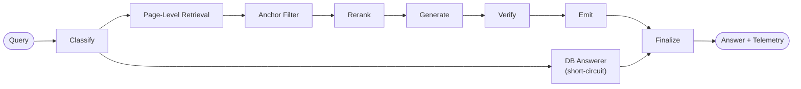
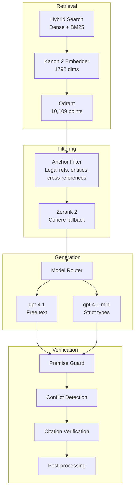

<div align="center">

# Agentic RAG Legal Challenge 2026

### Evidence-first legal question answering over DIFC regulations, case law, and contracts.

Built for the [Agentic RAG Legal Challenge](https://machinescansee.com) at Dubai AI Week & Machines Can See 2026.

[](https://python.org)
[](https://fastapi.tiangolo.com)
[](https://langchain-ai.github.io/langgraph/)
[](https://qdrant.tech)
[](LICENSE)
[](https://github.com/chernistry/shafi/actions/workflows/ci.yml)
[]()

</div>

---

A staged LangGraph pipeline that answers 900 legal questions over 300 DIFC documents with page-level retrieval, anchor-based filtering, and faithfulness guardrails. Developed over a 12-day competition sprint (March 10--22, 2026) with 1,598 commits, culminating in a multi-agent coordination phase where six AI agents worked in parallel on the final push.

> [!TIP]
> For the full write-up on what worked, what didn't, and the infrastructure-over-retrieval finding, see the [blog article](https://alexchernysh.com/blog/legal-answering-systems).

## Results

| Metric | Value |
|:-------|:------|
| Questions answered | 900 |
| Documents processed | 300 |
| Total pages indexed | 10,109 (+209% via registry enrichment) |
| Null answers | 3 |
| No-page-grounding answers | 3 |
| Corrections applied | 103+ (56 DOI dates, 11 comparisons, 32 booleans, 16 numbers) |
| Eval versions completed | V9.1 through V17 |
| Total commits | 1,598 |

## Key Findings

**Infrastructure beats retrieval.** The single biggest insight from the competition: investing in evaluation infrastructure, submission tooling, and automated correction pipelines produced more score improvement than any retrieval technique change.

**87.5% ablation rejection rate.** Seven of eight retrieval enhancements tested during the competition were rejected after ablation testing. BM25-only retrieval, RAG Fusion, HyDE, FlashRank, Isaacus EQA, step-back prompting, and citation-first retrieval all failed to improve over the baseline. Only the anchor-based page filtering survived.

**TTFT was the biggest remaining lever.** Late in the competition, time-to-first-token analysis revealed a +23.5% potential swing -- larger than any retrieval optimization still on the table.

**DB short-circuit for metadata questions.** 167 of 900 questions were answerable from corpus metadata alone (document titles, dates, registry entries), resolved in <50ms without an LLM call.

## Architecture

Every query flows through a staged LangGraph pipeline with page-first retrieval and anchor-based filtering:





### Design Choices

- **DB answerer short-circuit**: 167 metadata-answerable questions resolved via corpus registry lookup in <50ms
- **Page-first retrieval**: Hybrid search (dense + BM25) at page level, then anchor-based filtering for precision
- **Legal-domain embeddings**: Kanon 2 Embedder for DIFC-heavy terminology and statute references
- **Anchor filtering**: Extracts legal references, entity names, and cross-references to localize relevant pages
- **Reranking**: Zerank 2 with Cohere Rerank fallback for final page ordering
- **Model routing**: `gpt-4.1-mini` for strict answer types, `gpt-4.1` for complex free-text reasoning
- **Faithfulness guardrails**: Premise guard, conflict detection, citation verification, and final post-processing bound to `answer_final`
- **Telemetry bound to the final answer**: `used_page_ids`, `cited_page_ids`, per-stage timings, and model metadata in every response

Private phase corpus: 300 documents, 900 questions, 10,307 Qdrant points at 1,792 dims (Kanon-2).

---

## Quick Start

```bash
# 1. Clone and configure
git clone https://github.com/chernistry/shafi && cd shafi
cp .env.example .env
# Put machine-specific secrets in .env.local

# 2. Start the local stack (API + Qdrant)
docker compose up --build -d

# 3. Ingest the DIFC corpus
docker compose --profile tools run --rm ingest

# 4. Ask a question
curl -X POST http://localhost:8000/query \
  -H "Content-Type: application/json" \
  -d '{"question": "Which laws are administered by the Registrar?"}'
```

The default `docker compose` setup brings up:

- `qdrant` locally, with health checks
- `api` with warmup enabled by default
- `ingest` and `eval` as tool-profile services inside the same Docker network

No extra `QDRANT_URL` juggling is required for the default local workflow.

### Environment Contract

- Host-local `uv run ...` and other shell commands use `QDRANT_URL=http://localhost:6333`
- Docker Compose service containers always use `QDRANT_URL=http://qdrant:6333` internally
- Local config precedence: process env > `.env.local` > `.env` > code defaults
- Keep shared defaults in `.env`; keep workstation-specific overrides and secrets in `.env.local`

---

## Stack

| Layer | Choice |
|:------|:-------|
| API | FastAPI + SSE |
| Orchestration | LangGraph |
| Embeddings | Kanon 2 Embedder (1,792 dims) |
| Vector DB | Qdrant hybrid search |
| Reranker | Zerank 2, Cohere fallback |
| Complex LLM | `gpt-4.1` |
| Strict/simple LLM | `gpt-4.1-mini` |
| Validation | Pydantic v2 + Pyright strict |
| Tooling | `uv`, `ruff`, `pytest`, Docker Compose |

---

## Evaluation

Run the harness locally against the Dockerized API:

```bash
docker compose --profile tools run --rm eval \
  python -m shafi.eval.harness \
  --golden dataset/public_dataset.json \
  --endpoint http://api:8000/query \
  --concurrency 4 \
  --emit-cases \
  --judge \
  --judge-scope free_text \
  --judge-docs-dir dataset/dataset_documents \
  --judge-out data/judge_run.jsonl \
  --out data/eval_run.json
```

Tracked checks:

- Full public-set correctness
- `free_text` judge pass rate, accuracy, grounding, clarity
- Citation coverage
- Answer-type format compliance
- Document-retrieval diagnostics
- TTFT distribution
- Per-stage latency (`classify`, `embed`, `qdrant`, `rerank`, `llm`, `verify`)
- Platform submission projection and archive compliance

---

## Platform Submission

The repository has a separate **platform-native** submission path for warm-up and final runs.

<details>
<summary><strong>Submission workflow</strong></summary>

```bash
# 1. Start local infrastructure
docker compose up --build -d qdrant

# 2. Preflight: build and audit the curated code archive
docker compose --profile tools run --rm eval \
  python -m shafi.submission.platform --archive-only

# 3. Build a warm-up submission package
docker compose --profile tools run --rm eval \
  python -m shafi.submission.platform

# 4. Inspect generated artifacts
#   - platform_runs/<phase>/submission.json
#   - platform_runs/<phase>/preflight_summary.json
#   - platform_runs/<phase>/code_archive.zip
#   - platform_runs/<phase>/code_archive_audit.json

# 5. Submit the inspected artifact and poll status
docker compose --profile tools run --rm eval \
  python -m shafi.submission.platform \
    --submit-existing \
    --submission-path platform_runs/warmup/submission.json \
    --code-archive-path platform_runs/warmup/code_archive.zip \
    --poll
```

The flow downloads phase-specific documents, ingests them into a phase-specific Qdrant collection, then downloads questions and runs the RAG pipeline. Documents are ingested before questions to comply with the "no question-aware indexing" rule.

</details>

---

## Development

```bash
uv sync --extra dev       # install dev dependencies
make lint                 # ruff check src tests scripts
make typecheck            # pyright strict mode
make test                 # pytest tests/unit
make all                  # lint + typecheck + test
make format               # auto-fix with ruff
```

Script index: [docs/scripts_index.md](docs/scripts_index.md)

See [CONTRIBUTING.md](CONTRIBUTING.md) for the full development guide.

---

## Related

- **[Building Legal Answering Systems](https://alexchernysh.com/blog/legal-answering-systems)** -- Full write-up covering the competition experience, architecture decisions, the infrastructure-over-retrieval finding, and the multi-agent sprint
- **[Bernstein](https://github.com/chernistry/bernstein)** -- AI coding agent orchestrator born from this competition's multi-agent coordination patterns
- **[Competition Page](https://machinescansee.com)** -- Agentic RAG Legal Challenge at Dubai AI Week & Machines Can See 2026

---

## License

[AGPL-3.0 1.0.0](LICENSE) -- Free for non-commercial use. Commercial licensing: [alex@alexchernysh.com](mailto:alex@alexchernysh.com). See [COMMERCIAL-LICENSING.md](COMMERCIAL-LICENSING.md).
